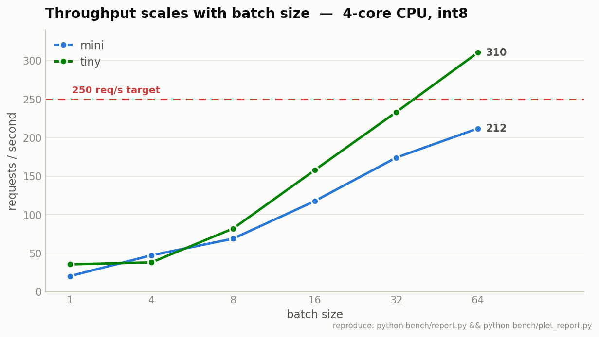
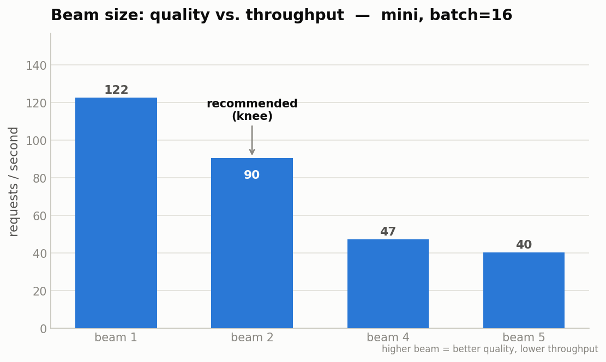

# EmailGrammar — Prototype Overview

*A CPU-only, LLM-free spelling & grammar correction service for email, built for
high throughput. This document explains what exists today, how it works, what it
can and cannot do, how fast it is, and how we plan to close the gaps.*

Companion files: [`EXAMPLES.md`](EXAMPLES.md) (19 live examples) and the
reproducible benchmark [`bench/report.py`](../bench/report.py).

---

## 1. TL;DR

- We correct email text in two model-free-of-LLMs stages: a **spell fixer**
  (SymSpell) and a **tiny grammar model** (a 16–31M-parameter T5) run on CPU via
  **CTranslate2** with int8 quantization.
- Between them sits an **entity-protection** layer that hides emails, URLs, order
  IDs, etc. behind placeholders ("sentinels") so the grammar model can't corrupt
  them, then restores them exactly.
- On a **4-core dev laptop**, the small model already sustains **~240 requests/s**
  with batching — the 250 req/s production target is realistic with headroom.
- The models are **MIT-licensed** (`visheratin/*`); the popular `vennify/*` model
  is deliberately excluded from the shippable path.
- The main open risk is **grammar quality** at these tiny model sizes (real, and
  sometimes meaning-changing, errors). We have a concrete evaluation + mitigation
  plan below.

---

## 2. Problem & constraints

We are building grammar/spell correction for **Rediff** (Rediffmail). Hard
constraints, in priority order:

| Constraint | Why it shapes the design |
|---|---|
| **No LLMs** | Cost, privacy, control. We use small "base models" instead. |
| **CPU-only** | No GPU budget in the serving fleet. Drives quantization + a tiny model + CTranslate2. |
| **≥ 250 requests/second** | The headline SLA. Drives **batching** as the core throughput lever. |
| **Never corrupt entities** | It's an *email* product — mangling a customer's address or order ID is a ship-blocker. Drives the entity-protection layer. |
| **Production-safe licensing** | Ships to a real product → MIT models only. |

**Client behaviour (context):** Rediff's client fires a correction request either
after **0.7s of typing inactivity** or after **two full-stops**. So our service
receives **short chunks (≈1–2 sentences)**, not whole emails — which is good news
for both latency and batching.

---

## 3. Architecture

```
 raw chunk
   │
   ▼
 [1] SPELLER  (SymSpell)          fix non-word typos:  recieve → receive
   │                              guarded: never touches CAPS/Names/URLs/digits
   ▼
 [2] PROTECTOR — mask             email/URL/id  →  __0__, __1__  (sentinels)
   │
   ▼
 [3] CORRECTOR (T5 + CTranslate2) fix grammar on the masked text (int8, batched)
   │
   ▼
 [2'] PROTECTOR — restore/verify  __0__ → email; if a sentinel was lost,
   │                              FALL BACK to the spell-only text (entity-safe)
   ▼
 corrected chunk
```

Each stage is independent and switchable (`use_speller`, `use_protector`, model
choice). Code map:

| Stage | File | One-liner |
|---|---|---|
| Speller | [`emailgrammar/speller.py`](../emailgrammar/speller.py) | Guarded, per-token SymSpell |
| Protector | [`emailgrammar/protect.py`](../emailgrammar/protect.py) | Placeholder masking + verify/fallback |
| Corrector | [`emailgrammar/corrector.py`](../emailgrammar/corrector.py) | Int8 T5 via CTranslate2 |
| Orchestration | [`emailgrammar/pipeline.py`](../emailgrammar/pipeline.py) | Wires the stages, batches |
| Config | [`emailgrammar/config.py`](../emailgrammar/config.py) | All tunables in one place |

### 3.1 Stage 1 — Speller (SymSpell)

Fixes **non-word errors** — strings that aren't valid words (`recieve`, `teh`).
It uses SymSpell's *Symmetric Delete* algorithm: microsecond-level dictionary
lookups (~5,000 sentences/s), so it is **never the bottleneck**.

We deliberately **do not** use SymSpell's `lookup_compound` (whole-sentence mode)
— it lowercases everything, strips punctuation, and rewrites tokens it doesn't
recognise, which is destructive for email. Instead we correct **token by token**
with **guard rails** — a token is only "correctable" if it is a plain lowercase
word not already in the dictionary. It is left untouched if it is:

- **ALL-CAPS** (`NASA`, `FIFA`, `EOD`) — acronym guard
- **Capitalised** (`Kevin`, `Anthropic`) — proper-noun guard
- **contains digits / `@` / `/`** (`v2.3`, `a@b.com`) — structured token
- shorter than 3 characters

This is how we keep named entities safe *at the spelling stage*.

### 3.2 Stage 2 — Protector (entity masking)  ← see §4 for "sentinel"

The grammar model is a text→text model; left to itself it happily rewrites an
email address into prose (we measured `john.doe@rediff.com → johndoerediff.com`).
So before the model sees the text, we **replace each structured span with a
sentinel** the model will copy verbatim, and **restore** it afterwards. Details
and the failure mode are in §4.

### 3.3 Stage 3 — Corrector (T5 + CTranslate2)

The grammar fixer is a **T5-efficient** model (`visheratin/t5-efficient-mini` or
`-tiny`) — a small encoder–decoder trained specifically for grammar correction.
Two engineering choices make it CPU-fast:

- **CTranslate2** — a C++ inference engine (no PyTorch at runtime). It releases
  the Python GIL, supports **batching**, and runs multiple **replicas**.
- **int8 quantization** — weights stored as 8-bit integers → ~2–4× faster on CPU
  and ~4× smaller (mini = **34 MB**, tiny = **19 MB** on disk).

These models need **no task prefix** (they were trained on a single task), so we
feed the (masked) text directly.

---

## 4. What is a "Sentinel"? (deep-dive, as requested)

A **sentinel** is a **placeholder** — a unique, meaningless marker we swap in for
a real value so that a downstream process treats it as opaque and passes it
through untouched, after which we swap the real value back.

Analogies:
- a **coat-check ticket**: you hand over your coat (the email), get a numbered tag
  (`__0__`), and redeem the exact same coat later;
- a **mail-merge field** like `[FIRST_NAME]` that gets filled in afterwards;
- a **variable placeholder** in a template.

**Why we need it.** Our grammar model tries to "improve" *everything* it sees,
including things that must not change:

```
input:  please email me at john.doe@rediff.com before 5pm
T5 raw: please email me at johndoerediff.com before 5 pm   ← address destroyed
```

**How we use it.** The protector detects structured spans and substitutes
sentinels, the model corrects the surrounding grammar, then we restore:

```
mask:    please email me at __0__ before __1__        (__0__=address, __1__=5pm)
T5:      Please email me at __0__ before __1__.
restore: Please email me at john.doe@rediff.com before 5pm.
```

**Why `__0__` specifically.** A sentinel only works if the model copies it back
*exactly*. We tested many candidates through the actual model; **only `__N__`
survived** — alphabetic/bracket/unicode markers got mangled (`ENT0`→`ENT 1`,
`⟦0⟧`→`0`). SentencePiece keeps the underscores and the model treats `__0__` as a
copy-through token.

**The failure mode (and our two-tier recovery).** Even `__N__` isn't bulletproof —
the model sometimes **eats the digit**: `__0__ → ____`. We restore in three tiers,
safest-first:

1. **Exact** — every sentinel survived verbatim → restore by index.
2. **Positional recovery** — the model kept the sentinels' *positions* but mangled
   them; if the count of placeholder-ish runs still matches, restore **by order**.
   (This is what turns `"I have mailed him on ____. Thank you."` back into the
   correct sentence *with* the email — instead of discarding the correction.)
3. **Fall back** — if even the counts don't match, emit the entity-safe spell-only
   text. Grammar is skipped, but **the entity is never corrupted**.

Real numbers can't be mistaken for sentinels (a run needs `≥2` underscores), so
`2026` in `"____ for 2026 tickets"` is left alone. On our 19-example set this
recovery took the fallback rate to **zero**.

**Scope boundary.** Masking protects *structured, regex-detectable* spans
(emails, URLs, `@handles`, `#tags`, domains, and any token with a digit: ids,
times, amounts, versions, phone numbers). It does **not** protect free-text
lowercase names (a person literally called `demra`) — those are invisible to
regex and remain a named-entity problem (see Limitations §7).

---

## 5. Key concepts (glossary for the talk)

| Term | Plain-English meaning |
|---|---|
| **Edit distance** (`max_edit_distance=2`) | How many single-character edits (insert/delete/substitute/**transpose**) separate a typo from a real word. `recieve→receive` = 1 (a transposition). Higher = catches messier typos but riskier. It is **character-level**, nothing to do with sentences. |
| **Beam size** | How many candidate sentences the grammar model keeps "in flight" while decoding. `1` = greedy (fastest). Larger = better quality but slower. Not one perfect value — a **trade-off curve** with a *knee* (≈2 for our mini model). |
| **intra_threads** | Threads used *inside one* correction (parallelising the math of a single inference). More = lower latency per request. |
| **inter_threads** | Number of parallel **replicas** — independent workers sharing the same weights, each handling a different batch at the same time. More = more concurrency. Budget: `cores ≈ inter × intra`. |
| **Quantization (int8)** | Storing model weights as 8-bit integers instead of 32-bit floats: smaller + faster on CPU, tiny quality cost. |
| **Batching** | Correcting many sentences in one model call. **Our single biggest throughput lever** (see §6). |
| **Sentinel** | Placeholder token that protects an entity through the model (see §4). |

---

## 6. Current specs & performance

> Numbers below are from a **4-core dev laptop** (the production fleet will differ).
> Everything is reproducible: `python bench/report.py` (writes `docs/assets/bench.csv`).

**Hardware measured on:** 4 vCPU, ~15 GB RAM, Linux 6.8, Python 3.10.12.
**Model sizes (int8 on disk):** mini = 34 MB, tiny = 19 MB.
**Runtime footprint:** CTranslate2 + tokenizer only — **no PyTorch** in production.

### 6.1 Single-request latency (batch = 1)

| Model | p50 | p95 | p99 |
|---|---|---|---|
| mini | 34 ms | 47 ms | 47 ms |
| tiny | 28 ms | 38 ms | 50 ms |

### 6.2 Throughput vs. batch size — *the key result*

Throughput scales strongly with batch size; the small model clears the target.
(Median of 3 runs, full pipeline, beam=1. Small-batch rows are noisy on a shared
4-core box — the signal is the trend from batch≥8.)

| Batch size | mini (req/s) | tiny (req/s) |
|---|---|---|
| 1  | 20  | 35  |
| 4  | 47  | 38  |
| 8  | 69  | 82  |
| 16 | 118 | 158 |
| 32 | 174 | 233 |
| 64 | 212 | **310** |



**Reading this:** at batch=1 (no batching) we get ~20–35 req/s; batching to 32–64
multiplies that ~6–10×. **tiny at batch≈32–64 exceeds 250 req/s on just 4 cores**;
mini reaches ~212 and clears 250 with more cores/replicas. The speller adds
essentially nothing (~6,500 sentences/s on its own).

### 6.3 Beam size — quality vs. throughput (mini, batch = 16)

| beam | throughput | quality note |
|---|---|---|
| 1 | 122 req/s | greedy; misses some fixes |
| **2** | **90 req/s** | **knee** — fixes noticeably more, small cost |
| 4 | 47 req/s | no gain over 2 on our samples |
| 5 | 40 req/s | no gain, ~3× slower than beam 1 |



**Recommended config: mini, beam = 2** (best quality/throughput point today);
switch to **tiny** if throughput must come first.

### 6.4 How we actually hit 250 req/s in production

Batching alone gets us there on 4 cores, but the production design combines:

1. **Dynamic micro-batching** — accumulate incoming requests for ~5–10 ms, then
   correct them in one `translate_batch` call (this is the multiplier above).
2. **A replica pool** (`inter_threads`) — several workers sharing one copy of the
   weights for concurrency across cores/boxes.
3. **Horizontal scaling** — the service is stateless; add instances behind a load
   balancer for linear scale-out.

This serving layer is the main not-yet-built piece (roadmap §8).

---

## 7. Limitations & how we plan around them

Shown honestly — several are visible in [`EXAMPLES.md`](EXAMPLES.md).

| # | Limitation | Example | Mitigation (roadmap) |
|---|---|---|---|
| L1 | **Grammar quality ceiling** of a 16–31M model; can occasionally **change meaning** (e.g. drop a negation: *"don't know" → "does know"*) | Ex. 5, 10, 15 | Quality eval harness → pick model/beam on data; **fine-tune/distill** on email data; consider a slightly larger CPU-viable model. Deploy as **suggestions, not silent auto-correct**, until quality is proven. |
| L2 | **SymSpell is context-blind** — picks the most frequent word within edit distance, so `cip` → `zip` not `cup` | Ex. 16 | Add SymSpell **bigram** context; let T5 arbitrate; in-domain frequency dictionary. |
| L3 | **Lowercase free-text names** aren't regex-detectable and can be mangled (`demra → "me a debra"`) | Ex. 17 | **Protected-terms dictionary** (O(1) allow-list); optional lightweight NER/gazetteer if data demands it. |
| L4 | **Chat abbreviations** mis-expanded (`pls → plus`, `thx → the`) | Ex. 8, 18, 19 | Small **abbreviation dictionary** (`pls→please`, `u→you`, `asap→as soon as possible`) as a normalization pass. |
| L5 | **Multi-entity fallback** — several sentinels can lose a digit → grammar skipped that sentence | — | **DONE** — positional sentinel-recovery (restore by order when counts match) took the example-set fallback rate to 0. Rare count-mismatch still falls back safely. |
| L6 | **No sentence segmentation yet** — long chunks truncate at 128 tokens; artifacts like `That works...` | Ex. 14 | Rule-based sentence splitter (also improves batching + quality). |
| L7 | **All-caps typos** left for T5 (by design, to protect acronyms); T5 usually but not always fixes them | Ex. 18 | Accept for now; optional heuristic later. |

**Deployment stance given L1:** because the model can occasionally change meaning,
the safe rollout is **suggest-and-confirm** (underline + propose), not silent
rewriting, until the eval harness shows the error rate is low enough.

### 7.1 Why some "obvious" errors slip through (worked example)

A natural meeting question: *"`I am gone insane` only got a full stop — why didn't
it fix the grammar?"* The answer is worth understanding, because it's **not a bug**
and **beam search won't fix it.**

**It's a capacity/coverage miss, not a decoding miss.** More search doesn't help,
and the smaller model makes it *worse*:

| input `I am gone insane` | beam 1 | beam 4 | beam 8 |
|---|---|---|---|
| mini | `I am gone insane.` | `I am gone insane.` | `I am gone insane.` |
| tiny | `I am gone insane.` | `I am gone insane`**`ly`**`.` | `…insanely.` |

**The specific reason: `am gone` is *locally valid* English.** Compare:

- `I am **go** insane`   → **`I am going insane.`** ✅ (`am go` is never grammatical → fixed with confidence)
- `I am **gone** insane` → `I am gone insane.` ❌ (`am gone` = *"I've left / I'm out of here"* — perfectly valid, like *"I am tired/done"*)

Every local piece reads fine (`I am` ✓, `am gone` ✓); the error only exists at the
**phrase level** — *"gone insane"* wants *"have gone insane"*, a longer-range
dependency. GEC models are trained for **high precision** (they copy when unsure,
because a wrong "fix" costs more than a miss under F0.5), so a locally-valid string
with no strong error signal is copied through — the model still applies what it
*is* sure about (capitalisation, the full stop).

**The model is not broken — it handles the common cases well.** Same run, mini:

```
he go to school → He goes to school.   ✅   they is happy → They are happy.   ✅
I are tired     → I am tired.          ✅   a apple       → an apple.         ✅
he gone home    → He went home.        ✅   (missing auxiliary supplied)
```

It reliably fixes frequent error types; `am gone insane` is an uncommon,
locally-valid-looking construction in the long tail these 16–31M models don't
cover. (The same probe also shows an L1 over-correction: `I have went there → I
have been there` — meaning changed — reinforcing suggest-and-confirm.)

**Lever:** this gap is *coverage*, not search — beam and swapping between these
tiny checkpoints won't close it. The real fixes are the **eval harness** (to
quantify how often the tail bites) and **fine-tuning/distilling on email data** or
a **slightly larger CPU-viable model**. *(To be decided after the meeting.)*

---

## 8. Evaluation

### 8.1 First results — in-house eval set (589 rows) → [EVAL_RESULTS.md](EVAL_RESULTS.md)

We now have real numbers on the labeled eval set (`t5_8bit_fully_trained_check.csv`),
scored against its gold column and compared to the **fully fine-tuned** reference
model in the same file:

| System | normalized-match | avg char-sim to gold |
|---|---|---|
| raw input | — | 0.893 |
| **OURS** (mini, beam 2) | **29.2%** | 0.887 |
| reference (fine-tuned) | **50.6%** | 0.909 |

Two headlines: **base models are ~half the fine-tuned model's accuracy**, and our
edits are **net-neutral-to-slightly-negative on average** (0.887 < 0.893) — largely
because our entity-protection *by design* leaves the eval's "Names/Casing/Currency/
Dates/Numbers" categories uncorrected. Full breakdown, the design-tension lever, and
implications are in **[EVAL_RESULTS.md](EVAL_RESULTS.md)**. Reproduce:
`python bench/eval_dataset.py --model mini --beam 2`.

### 8.2 Standard public benchmarks

There is a well-established set of GEC (Grammatical Error Correction) benchmarks
we can also score against, so quality generalizes beyond the in-house set:

| Benchmark | Size | Metric | Best for us |
|---|---|---|---|
| **JFLEG** | 747 sentences, 4 references each | **GLEU** | **Most relevant** — rewards *fluent* rewrites, which matches email tone. |
| **BEA-2019** (W&I+LOCNESS) | 4,477 test sentences | **ERRANT** F0.5 | The current academic standard; 25 error categories. |
| **CoNLL-2014** | 1,312 sentences | **M² / F0.5** | Long-standing baseline; minimal-edit precision. |

Metrics: **GLEU** (fluency, JFLEG), **ERRANT** F0.5 (official BEA-19, edit-level),
**M²** F0.5 (CoNLL-14). F0.5 weights *precision* over recall — appropriate for
correction, where a wrong "fix" is worse than a miss.

**Our plan:**
1. Wire a **JFLEG + GLEU** harness first (fluency, closest to email) to pick
   **tiny vs mini** and **beam size** on data.
2. Add **BEA-2019 dev + ERRANT** for edit-level precision/recall and to watch for
   meaning-changing edits (L1).
3. Build a **small in-domain email test set** (real noisy Rediff-style text) —
   the ultimate arbiter, since public sets skew toward learner essays.

Reference: [NLP-progress GEC leaderboard](http://nlpprogress.com/english/grammatical_error_correction.html),
[BEA-2019 shared task](https://www.cl.cam.ac.uk/research/nl/bea2019st/).

---

## 9. Roadmap (priority order)

1. ~~Positional sentinel-recovery~~ — **done** (fallback rate → 0 on the example set).
2. **Sentence segmentation** — kill truncation + artifacts, improve batching (L6).
3. **Quality eval harness** (JFLEG/GLEU, then BEA/ERRANT) — make model/beam a
   data decision (L1).
4. **Abbreviation + protected-terms dictionaries** (L3, L4).
5. **Serving layer** — dynamic micro-batching + replica pool (the real 250 req/s).
6. **Training / fine-tuning** — the eval (§8.1) shows base models are ~half the
   fine-tuned bar, so this is now a primary track, not a contingency. Full plan:
   **[TRAINING_PLAN.md](TRAINING_PLAN.md)** (staged synthetic→real training, tagged
   corruption matched to our categories, distillation, edit-tagging spike).

---

## 10. Reproduce everything

```bash
# setup
python -m venv .grammar && source .grammar/bin/activate
pip install -r requirements-dev.txt
pip install torch --index-url https://download.pytorch.org/whl/cpu

# one-time model conversion (int8)
python scripts/convert_model.py --model mini --quantization int8
python scripts/convert_model.py --model tiny --quantization int8

# try it
python -m emailgrammar --detailed "i has recieve you're emails yesterday"

# regenerate the numbers in §6 and the examples
python bench/report.py --out docs/assets/bench.csv
python scripts/gen_examples.py
```

## 11. Appendix — stack & licensing

- **Models:** `visheratin/t5-efficient-{mini,tiny}-grammar-correction` — **MIT**.
  `vennify/t5-base-grammar-correction` intentionally **excluded** from production
  (kept only as a quality reference).
- **Runtime deps:** `ctranslate2`, `sentencepiece`, `transformers` (tokenizer
  only), `symspellpy` — **no torch**.
- **Conversion deps (offline):** `torch` (CPU), `transformers ≥ 4.56` (older
  versions crash the CTranslate2 converter on a `dtype` kwarg).
